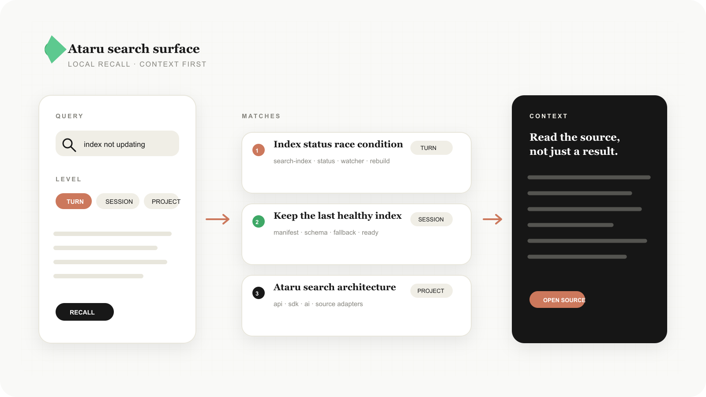
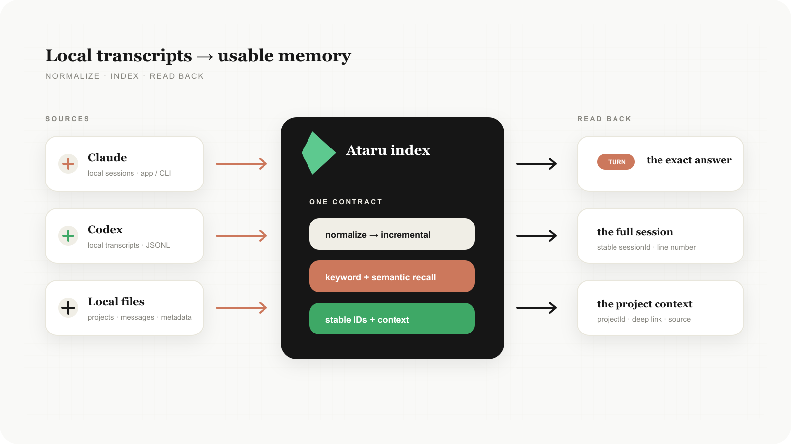
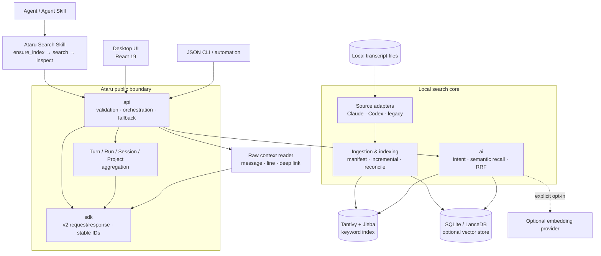

<p align="center">
  
</p>

<h1 align="center">
  
  Ataru
</h1>

<p align="center">
  <strong>在本地，快速找回过去 AI 对话中的答案。</strong><br>
  <sub>Search the memory of your AI work.</sub><br>
  <sub>macOS · Windows · Linux</sub>
</p>

<p align="center">
  
  
  
  
</p>

<p align="center">
  <a href="#why-ataru">为什么是 Ataru</a> ·
  <a href="#product-path">产品路径</a> ·
  <a href="#quick-start">快速开始</a> ·
  <a href="#agent-skill">Agent Skill</a> ·
  <a href="#architecture">架构</a> ·
  <a href="#development">开发</a> ·
  <a href="#appendix--faq">附录与 FAQ</a>
</p>

## Why Ataru

AI 编程过程中，真正有价值的答案经常已经出现过：一次故障排查、一条关键命令、一个架构取舍，或者一段几周前才讨论过的上下文。但这些内容分散在不同 Agent 的本地会话文件里，靠记忆、目录名和人工翻找很难重新定位。

Ataru 把这些已经发生过的对话变成本地可检索的记忆层：

- 从 Claude、Codex 等本地会话来源建立统一索引。
- 用关键词、字段、短语或自然语言描述找回相关上下文。
- 在 `Turn`、`Run`、`Session`、`Project` 四种粒度之间切换。
- 从命中片段回到原始会话、消息和行号，而不是只展示一段截断摘要。
- 默认离线运行；语义检索是可选增强，未配置或超时会清晰降级到关键词检索。

Ataru 的目标不是管理正在运行的 Agent，而是让过去的工作重新变得可用。

## What it does

| 能力 | 解决的问题 |
| --- | --- |
| 统一采集 | Claude CLI、Claude App/Web、Codex 等来源的会话格式不同，Ataru 在适配层归一化它们。 |
| 增量索引 | 新消息写入后自动追赶索引，不需要每次从头扫描全部历史。 |
| 中文友好全文检索 | Tantivy + Jieba 同时覆盖中文、代码、域名、包名和错误串。 |
| 混合召回 | 关键词适合精确匹配，自然语言问题可在语义索引可用时使用混合召回。 |
| 层级聚合 | 同一命中可以按 Turn、Run、Session 或 Project 汇总，减少重复结果。 |
| 上下文回读 | 保留稳定的 Project/Session/Run/Turn 标识、片段、角色、时间和行号。 |
| Agent 接入 | GUI、CLI 和 Agent Skill 共用同一套搜索契约，不把检索逻辑复制到各个客户端。 |

## Product path

Ataru 的主路径只有两步：把本地会话整理成可检索的记忆，再从命中结果回到原始上下文。

### 搜索召回



<p align="center"><sub>从一句自然语言问题，定位到 Turn、Run、Session 或 Project，再回读原始上下文。</sub></p>

### 本地索引



<p align="center"><sub>Claude、Codex 等本地会话统一进入 Ataru 索引，并通过稳定 ID 回到具体来源。</sub></p>

## Quick start

### 使用桌面应用

从 [GitHub Releases](https://github.com/lovstudio/Ataru/releases) 下载对应平台版本，启动后进入搜索页即可开始。

第一次使用时，Ataru 会先检查本地索引：

1. 读取索引清单和 schema 版本。
2. 如果索引不存在、过期或状态为 `idle`，启动一次索引构建。
3. 通过 `search-index:build` 事件报告进度。
4. 状态变为 `ready` 后，搜索输入才会执行查询。

索引是派生数据，不会改写原始会话；重建失败时保留上一个健康索引。

### 运行本地开发版本

```bash
git clone --recursive https://github.com/lovstudio/Ataru.git
cd Ataru
pnpm install
pnpm dev:app
```

前端热更新和不自动重启 Rust 的开发模式：

```bash
pnpm dev
pnpm dev:app:no-watch
```

## Agent Skill

GUI 只是 Ataru 的一个客户端。面向 Agent 的正确抽象是一项单独的 `Ataru Search Skill`：它负责把“确认索引可用、发起搜索、读取上下文”变成一个稳定动作，而不是让每个 Agent 自己理解 Tantivy、文件路径或来源格式。

### Skill 的最小工作流

```text
ensure_index → search → inspect → return stable context
```

| Skill 动作 | 具体行为 | 当前实现边界 |
| --- | --- | --- |
| `ensure_index` | 调用 `get_search_index_status`；索引未就绪时调用 `start_search_index_build(false)`，等待状态变为 `ready` 或返回可复制错误。 | 桌面搜索页已经自动执行；独立 Skill/无界面 Runner 必须显式执行这一步。 |
| `search` | 调用版本化的 `ataru_search`，传入 `query`、`level`、`mode` 和 `limit`。 | Rust `api` 与 TypeScript SDK 已落地。 |
| `inspect` | 使用结果中的稳定 `projectId`、`sessionId`、`messageId`、`lineNumber` 回读原始会话。 | 不从标题或展示路径重新猜测实体 ID。 |
| `return` | 返回命中、实际检索模式、耗时、warnings 和可深链定位信息。 | 语义不可用时保留 `ATARU_*_FALLBACK` 警告。 |

### Skill 接入示例

面向 Tauri/桌面宿主时，Skill 只需要依赖以下公开命令：

```ts
const status = await invoke("get_search_index_status");

if (status.state !== "ready") {
  await invoke("start_search_index_build", { force: false });
  // 等待 search-index:build 事件，直到 state === "ready" 或 state === "error"
}

const response = await invoke("ataru_search", {
  request: {
    query: "上次是怎么解决索引没有更新的？",
    level: "turn",
    mode: "auto",
    limit: 20,
  },
});
```

无界面环境可以通过 JSON CLI 调用同一套搜索契约；首次查询前仍需完成 `ensure_index`。

Skill 不拥有另一套索引，也不复制排序算法；它只是 `api/sdk` 契约的 Agent-facing adapter。独立 `SKILL.md` 包装层应复用这套 `ensure_index → search → inspect` 流程，避免 CLI、桌面端和不同 Agent 之间出现三套行为。

## Architecture

Ataru 是一个本地优先的模块化单体。GUI、CLI 和 Agent Skill 都是客户端，核心检索能力集中在 Rust 的 `sdk`、`api`、`ai`、来源适配器和索引管线中。



## Modules

### 1. Agent Skill adapter

**职责：** 为 Agent 提供单一的历史检索动作，处理索引初始化、查询参数、结果解释和上下文回读。

**边界：** Skill 不直接扫描 `~/.claude` 或 `~/.codex`，不解析 JSONL，不维护自己的缓存；所有事实都来自 `api` 返回的稳定契约。它可以运行在桌面宿主、CLI wrapper 或其他支持 Agent Skills 的环境中。

**关键协议：** `ensure_index`、`search`、`inspect`、`return`。其中 `ensure_index` 是首次使用的必要步骤，不能把“索引尚未构建”伪装成零结果。

### 2. `sdk`：稳定领域契约

**代码：** `src-tauri/src/app/ataru/sdk.rs`、`src/modules/sdk/search.ts`

**负责：**

- `SearchRequest` / `SearchResponse` / `SearchHit`。
- `SearchLevel = turn | run | session | project`。
- `SearchMode = auto | keyword | semantic | hybrid`。
- 稳定实体 ID、排序信号、warnings 和错误边界。
- Turn/Run/Session/Project 聚合规则。

**不负责：** Tauri 命令、文件系统、HTTP、具体索引实现或 UI 状态。`sdk` 是依赖图中最底层的公开语言层，不能反向引用 `api` 或 `ai`。

### 3. `api`：入口、编排与降级

**代码：** `src-tauri/src/app/ataru/api.rs`、`src/modules/api/ataru.ts`

**负责：**

- 校验查询、限制 Top-K 和项目过滤。
- 根据 `auto` 判断使用关键词或混合检索。
- 并发关键词与语义召回，执行 deadline 和取消。
- 汇总层级结果，返回真实执行模式、耗时和 `ATARU_*` warnings。
- 通过 Tauri IPC 暴露 `ataru_search`、索引状态和索引构建入口。

**不负责：** 解析供应商文件、实现 tokenizer 或决定具体 Embedding 模型。

### 4. Source adapters：来源适配与规范化

**代码：** `src-tauri/src/app/session_parsing.rs`、`src-tauri/src/app/session_listing.rs`、`src-tauri/src/app/search.rs`

**负责：** 读取不同 Agent 产生的本地 transcript，将不一致的记录转成统一的 Project、Session、Turn 和 Message。来源 ID 能稳定复用时必须保持复用，避免深链和历史映射失效。

**输入：** Claude CLI/App/Web、Codex 活跃与归档会话文件。

**输出：** 带来源、项目、会话、回合、消息位置和时间戳的规范化记录。

**原则：** 不改写原始 transcript；坏记录隔离并报告 `ATARU_PARTIAL_SOURCE`，其余来源继续可用。

### 5. Ingestion & indexing：采集、增量与对账

**代码：** `src-tauri/src/app/search.rs`、`src-tauri/src/app/core.rs`

**负责：**

- 首次全量建立 Tantivy schema 和索引清单。
- Claude/Codex 文件变化后的增量追加或重建。
- 使用 `search-index-manifest.json` 比较路径、大小、mtime、摘要和删除标记。
- 以 single-flight 合并并发构建请求。
- 先写临时目录，schema 校验和冒烟查询通过后原子切换。

**索引状态：** `idle → building → ready`；异常进入 `error`，并保留上一个健康索引。构建进度通过 `search-index:build` 事件发送给 UI 或 Skill 宿主。

### 6. `ai`：查询意图、语义召回与融合

**代码：** `src-tauri/src/app/ataru/ai.rs`、`src-tauri/src/app/search.rs`

**负责：**

- 判断查询是否更适合精确关键词或自然语言召回。
- 在语义索引健康时执行向量召回。
- 使用 RRF 合并关键词与语义候选。
- 在远程 Embedding 不可用、超时或未配置时退回关键词结果。

**默认行为：** 语义检索是 opt-in 增强，不会成为离线可用的前置条件；响应会保留实际 `mode` 和明确的 fallback warning。

### 7. Storage：本地事实与派生数据

**事实来源：** 用户本机的 Claude/Codex 会话文件。

**派生数据：** Tantivy 全文索引、`search-index-manifest.json`、可选 SQLite/LanceDB 向量索引和会话缓存。

**边界：** Ataru 可以清除或重建派生索引，但不删除原始会话。远程语义提供方只有在用户显式配置后才参与，并且只接收完成召回所需的最小化文本。

### 8. Desktop UI：搜索、验证与阅读

**代码：** `src/modules/ui/AtaruSearchPage.tsx`、`src/modules/ui/ataru-search/*`、`src/components/*`

**负责：** 搜索输入、IME 候选提交、层级/模式切换、索引状态、命中高亮、原始上下文预览和复制/深链动作。

**重要约束：** UI 是契约消费者，不从展示标题重建实体 ID；搜索输入和结果绘制不能等待全量会话读取；索引构建状态必须可见并支持重试。

### 9. CLI：无界面 JSON 自动化

**代码：** `src-tauri/src/app/cli.rs`、`src-tauri/src/app/run.rs`

CLI 在 Tauri 初始化之前处理 `search` 请求，适合 Agent wrapper、脚本和 CI。它支持
`search <query> --json [--limit N] [--level turn|run|session|project]`，以及按稳定身份读取完整会话：

```bash
ataru session read \
  --project-id PROJECT_ID \
  --session-id SESSION_ID \
  --json
```

`session read` 输出当前页面可见的消息 JSON，并按源文件顺序保留 `uuid`、`line_number`、角色和正文。
档案阅读器的“复制给 Agent”还会复制 `ataru-agent-context/v1`，其中包含同一组稳定 ID、真实源文件路径、CLI 参数、Tauri command 和当前页面消息快照。

新的聚合查询使用 Ataru v2 response。无界面调用方应先完成 `ensure_index`，不要在索引缺失时重复提交相同查询。

### 10. Observability & compatibility

**可观测性：** 记录本地 request ID、阶段耗时、候选数、结果数、索引版本和 fallback code，不记录原始查询、会话正文、完整路径或密钥。

**兼容性：** 原始数据格式、既有 Tauri commands、JSON 字段和稳定映射 ID 通过 adapter 保留；v2 允许增加可选字段和 warning，不随意改变已有实体 ID。

## Search and indexing lifecycle

### 写入链路

```text
transcript write
  → source adapter
  → normalized Project / Session / Run / Turn
  → single-writer queue
  → Tantivy commit + manifest update
  → optional vector index catch-up
  → searchable
```

### 查询链路

```text
Skill / CLI / UI
  → ensure_index
  → api validates request and deadline
  → keyword and/or semantic recall
  → RRF fusion
  → Turn / Run / Session / Project aggregation
  → stable hit + snippet + source location
```

查询粒度的语义：

| 粒度 | 聚合键 | 最适合 |
| --- | --- | --- |
| `turn` | `project + session + message` | 找到“当时具体哪条消息或工具记录” |
| `run` | `project + session + run` | 找到“当次完整执行如何完成” |
| `session` | `project + session` | 回看一次完整讨论 |
| `project` | `project` | 了解一个项目的历史决策与演进 |

## Privacy and reliability

- 默认本地运行，不要求账号或云端服务。
- 原始 transcript 只读；索引和缓存都是可重建的派生数据。
- 语义搜索可关闭；远程 Embedding 必须显式配置。
- 查询失败、索引损坏、超时和部分来源错误都有稳定错误码或 warning，不把故障伪装成空结果。
- 全量重建在临时目录中完成，成功后原子替换；磁盘不足、取消或崩溃不会覆盖健康索引。

## Development

### Commands

```bash
# Frontend development
pnpm dev

# Tauri desktop development
pnpm dev:app

# Frontend HMR without automatic Rust restart
pnpm dev:app:no-watch

# Build a distributable package
pnpm tauri build
```

### Repository layout

```text
src/                         React 19 frontend and shared client contracts
src/modules/sdk/             TypeScript search DTOs
src/modules/api/             Tauri-facing Ataru client
src/modules/ui/              Search, result and transcript surfaces
src-tauri/src/app/ataru/     Rust sdk/api/ai boundary
src-tauri/src/app/search.rs  Source parsing, indexing and legacy adapters
src-tauri/src/app/cli.rs     JSON CLI entry
docs/architecture/           Architecture decisions and detailed contracts
docs/images/                 README cover and current product path visuals
```

### Tech stack

| Layer | Technology |
| --- | --- |
| Desktop shell | Tauri 2 |
| Frontend | React 19, TypeScript, Vite, Tailwind CSS, shadcn/ui |
| Search | Tantivy + Jieba |
| Semantic recall | OpenAI-compatible Embeddings, SQLite/LanceDB adapters |
| Backend | Rust 2021 |
| State | React Query, Jotai, Tauri events |

## Documentation

- [Ataru 搜索架构](docs/architecture/ataru-search-architecture.md)
- [ADR-0001：本地优先的模块化单体](docs/adr/0001-ataru-search-modular-monolith.md)
- [代理与 Embedding 配置](docs/proxy-configuration.md)
- [性能与真实运行证据](docs/performance/ataru-startup-2026-08-10/runtime-report.md)
- [Warm Academic 设计规范](docs/design-guide.md)

## Star History

[](https://star-history.com/#lovstudio/Ataru&Date)

## Appendix / FAQ

### Ataru 与 Yoda 是什么关系？

Ataru 负责“过去聊过什么、答案和上下文在哪里”；Yoda 负责“现在由哪个 Agent 继续执行以及如何交付”。Ataru 可以把已找回的项目、会话或回合交给 Yoda，但不拥有运行中 Agent、PTY 或任务编排状态。

### 为什么代码、CLI 或本地目录里仍然会出现 Lovcode？

Ataru 从 Lovcode 演进而来。新安装和新脚本使用 `ataru`；为避免旧安装、历史索引、更新通道和外部映射失效，当前阶段保留 `lovcode` 可执行文件与旧 CLI 命令作为兼容入口，同时保留 `lovcode:*` 存储键和 `LOVCODE_*` 环境变量。这些是兼容层，不是新的产品定位。

### Ataru 的本地数据目录在哪里？

Ataru 的主数据目录是 `~/.lovstudio/ataru`。会话缓存、历史索引、全文搜索索引以及其他派生数据都会写入这个目录（macOS 的全文索引位于 `~/Library/Application Support/ataru/search-index`）。

旧安装留下的 `~/.lovstudio/lovcode` 只作为迁移来源：Ataru 启动时会优先读取新目录，并把旧目录中缺少的文件复制到新目录；旧文件不会被删除。新用户不会创建 `~/.lovstudio/lovcode`。

如果你说的是 Skills 的全局 profile，它仍然是独立的 `~/.lovstudio/skills/profile.json`，不属于 Ataru 的应用数据目录。

### Lovstudio 是什么？

Lovstudio（中文：手工川工作室，英文：Lovstudio.AI）是 Ataru 的维护方。品牌、公司和生态信息不影响 Ataru 的本地搜索核心。

### Ataru 会把我的对话上传到云端吗？

默认不会。关键词索引和查询都在本机完成。只有显式配置远程 Embedding 时，最小化的检索文本才会发送给指定提供方；配置入口、模型和数据范围应由用户自行确认。

### 索引可以删除吗？

可以。索引、manifest、向量库和缓存都是派生数据，删除后可以从原始 transcript 重新构建；删除索引不会删除原始对话。

### 如何从脚本调用 JSON CLI？

新安装的 CLI 主入口是 `ataru`：

```bash
ataru search "索引没有更新" --json --limit 20
ataru search "索引没有更新" --json --level turn --limit 20
```

旧脚本仍可继续使用 `lovcode search ...`，它会进入同一套 Ataru 实现。

无界面调用方应在首次查询前完成索引初始化；桌面端会自动执行，独立 Skill Runner 需要显式调用 `get_search_index_status` 和 `start_search_index_build`。

## License

Apache-2.0
