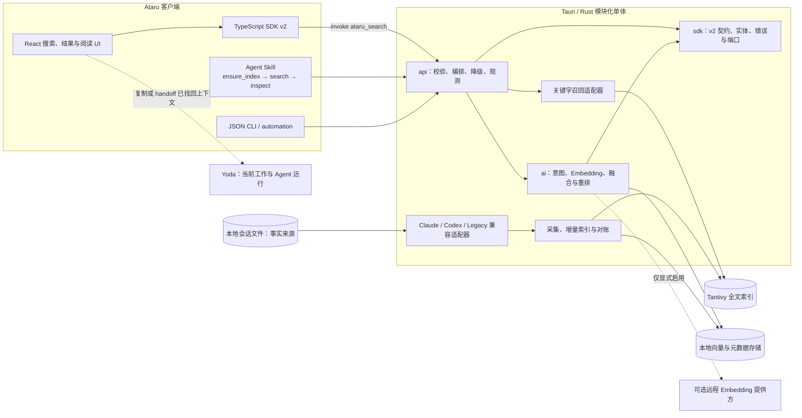

# Ataru 搜索架构

本文定义 Ataru v2 的产品边界、领域契约、模块结构、质量门槛和从 Lovcode 迁移的路径。它描述目标架构；阶段尚未通过验收前，不应把目标指标写成已经达成。

> 实现快照（2026-08-14）：v2 facade、Turn/Run/Session/Project 聚合、搜索主界面、关键词检索、语义检索显式启用、查询时限、项目预过滤与关键词增量构建 single-flight 已落地。语义索引仍使用 SQLite 持久化和全量初始化，尚不满足“不在查询内重建”与可恢复后台任务门槛；后续切分见 ADR-0002。固定相关性评测、TTCR 埋点和热进程 p95 基准也仍待验收。Agent Skill 作为独立客户端边界，必须先完成索引初始化，再调用 v2 搜索契约。

## 1. 产品边界与成功标准

Ataru 是“过去的 AI 对话召回器”，不是新的 Agent 工作台。

| 产品  | 拥有的状态                             | 主动作                            | 不负责                                         |
| ----- | -------------------------------------- | --------------------------------- | ---------------------------------------------- |
| Ataru | 已落盘会话、派生索引、搜索历史         | 搜索、筛选、聚合、阅读、复制/交接 | 创建或监控运行中 Agent、PTY 生命周期、任务编排 |
| Yoda  | 当前任务、运行状态、Agent/终端生命周期 | 创建、执行、监控、续接工作        | 历史语料的统一采集与长期检索                   |

Ataru 可以把命中的项目、会话或回合作为显式 handoff 交给 Yoda；handoff 是两个产品之间的边界事件，不会把运行状态复制回 Ataru。

### 北极星指标：TTCR

**TTCR（Time To Correct Recall）** 从一次搜索会话中的第一次非空输入开始，到第一次对正确结果执行“成功上下文动作”为止。成功动作包括：

- 打开一个结果并停留至少 5 秒；
- 从结果复制、导出或发起 handoff；
- 直接打开命中位置对应的完整会话。

五分钟内没有成功动作的搜索记为未成功，不进入耗时分位数，但必须进入成功率分母，防止只优化少数成功样本。北极星看板同时展示 TTCR p50/p90、召回成功率、零结果率和查询改写次数。Phase 0 先建立本地基线，再为 TTCR 设置绝对发布门槛；不能用后端 `tookMs` 代替 TTCR。

指标事件默认只保存在本机，记录时间、模式、结果数量和匿名结果 ID，不记录原始查询、正文、完整路径或 API Key。

## 2. 非功能门槛

| 指标       |      v1 目标 | 测量边界                                                      |
| ---------- | -----------: | ------------------------------------------------------------- |
| 输入响应   |  p95 ≤ 50 ms | 键盘事件到查询文本完成绘制；不包含搜索返回                    |
| 关键字搜索 | p95 ≤ 100 ms | `ataru_search` 收到请求到响应序列化完成；索引健康且进程已热   |
| 混合搜索   | p95 ≤ 800 ms | 包含查询向量化、双路召回、融合与序列化；不含首次建库/下载模型 |
| 搜索新鲜度 |    p95 ≤ 2 s | 来源文件完成一次可观察写入，到新回合能被关键字搜索命中        |
| Recall@10  |       ≥ 0.90 | 版本化人工标注集上的 `auto/hybrid` Top-10                     |
| MRR@10     |       ≥ 0.75 | 同一评测集上的第一个相关结果倒数排名                          |

每次发布报告必须注明应用版本、索引版本、机器、冷热状态、消息/会话规模和语义提供方。主基准使用固定的中英文、代码、错误串、路径、Claude 与 Codex 混合语料；结果按语料规模分桶，禁止用缩小数据集掩盖回归。远程语义提供方超过时限时，800 ms 门槛按实际降级后的端到端响应计算。

## 3. 领域模型

- **Project**：规范化工作目录及其历史集合。主键为 `projectId`；路径用于展示和兼容兜底，不作为唯一业务标识。
- **Session**：某个来源的一条完整对话记录。主键为 `(projectId, sessionId)`；`source` 区分 Claude、Codex 等来源。
- **Run**：一次完整执行，从用户提出问题开始，到 AI 完成最终回应结束，包含多个 Turn。主键为 `(projectId, sessionId, runIndex)`；底层 `round_index` 是兼容存储字段。
- **Turn**：最小原子 transcript item，代表一条用户消息、AI 回复、工具调用或工具结果。主键为 `(projectId, sessionId, messageId, lineNumber)`，不拥有标题。

## 4. 高层架构



### 模块职责与依赖规则

| 模块                 | 负责                                                                      | 不负责                                         |
| -------------------- | ------------------------------------------------------------------------- | ---------------------------------------------- |
| `sdk`                | `SearchRequest/Response/Hit`、枚举、稳定 ID、错误码、召回/来源/索引端口   | Tauri 命令、文件访问、HTTP、具体索引或排序实现 |
| `api`                | 传输适配、参数校验、deadline、`auto` 决策编排、聚合、降级、响应版本与指标 | 解析供应商文件、实现 Embedding 算法            |
| `ai`                 | 查询意图、语义召回、RRF/重排、语义健康检查                                | UI、原始文件扫描、关键字查询语法               |
| `agent skill`        | 索引就绪检查、统一搜索动作、稳定 ID 回读和 Agent 友好错误                 | 自建索引、重复解析来源文件、复制排序实现       |
| `ingestion/indexing` | 来源规范化、全量/增量构建、manifest、single-flight、原子切换              | 面向用户的查询编排和 UI 展示                   |
| 兼容适配器           | 复用现有解析器、`search_chats`、`semantic_search_chats` 与索引清单        | 向调用方暴露旧数据形状                         |

允许的编译期方向是 `api -> sdk`、`api -> ai`、`ai -> sdk`。`sdk` 不得引用 `api` 或 `ai`；兼容代码通过 `sdk` 端口接入。耗时解析、建索引和远程请求必须离开 UI/IPC 主线程，并设置取消与资源上限。

客户端继续遵循 Warm Academic 设计系统：使用语义颜色类、`font-serif` 标题与 shadcn/ui 组件；视觉效果不得阻塞查询输入或结果绘制。

### Agent Skill 客户端边界

Agent Skill 是搜索能力面向 Agent 的薄适配层。它与桌面 UI、JSON CLI 共享同一套 `sdk/api` 契约，不能直接读取 Claude/Codex 文件，也不能在外部再维护一份 Tantivy 或向量索引。

最小工作流固定为：

1. `get_search_index_status`：读取索引是否存在、是否过期、是否正在构建。
2. `start_search_index_build({ force: false })`：状态不是 `ready` 时启动或合并一次构建请求。
3. 监听 `search-index:build`：等待 `ready`，或把 `error` 转成可复制的诊断信息。
4. `ataru_search({ request })`：按 `turn/run/session/project` 和 `auto/keyword/semantic/hybrid` 查询。
5. 使用响应中的稳定 ID 和来源位置回读原始上下文，不从标题或展示路径推导实体。

桌面搜索页已经在首次进入时自动完成第 1–3 步；无界面 Skill Runner 必须显式执行它们。CLI 兼容入口适合读取已有关键词索引，Skill 包装层应在 CLI 查询前复用同一套索引就绪协议。

## 5. v2 搜索 API 契约

Tauri 调用形式为 `invoke("ataru_search", { request })`。传输字段统一使用 camelCase；响应中的 `version` 是契约主版本。

### 请求

```ts
type SearchLevel = "turn" | "run" | "session" | "project";
type SearchMode = "auto" | "keyword" | "semantic" | "hybrid";

interface SearchRequestV2 {
  query: string;
  level?: SearchLevel; // 默认 turn
  mode?: SearchMode; // 默认 auto
  limit?: number; // 默认 40，服务端约束到 1..100
  projectId?: string | null; // 可选精确项目过滤
}
```

`query` 去除首尾空白后不能为空。`auto` 对带字段限定、布尔操作符、精确短语或明显标识符的查询优先关键字；对自然语言问题在语义能力健康时使用混合搜索，否则使用关键字。

### 响应

```ts
interface SearchResponseV2 {
  version: 2;
  query: string; // 规范化后的实际查询
  level: SearchLevel;
  requestedMode: SearchMode;
  mode: SearchMode; // 实际执行模式，可能已降级
  semanticAvailable: boolean;
  tookMs: number;
  total: number; // 本次返回的聚合结果数，不是全库命中总数
  hits: SearchHitV2[];
  warnings?: string[];
}

interface SearchHitV2 {
  id: string;
  level: SearchLevel;
  title: string;
  snippet: string;
  projectId: string;
  projectPath: string;
  sessionId?: string;
  sessionTitle?: string;
  runIndex?: number;
  runPrompt?: string;
  messageId?: string;
  lineNumber?: number;
  role?: string;
  timestamp?: string; // ISO 8601
  matchCount: number;
  sessionCount: number;
  score: number; // 仅用于同一响应内排序
  signals: {
    lexical?: number;
    semantic?: number;
    fusion: number;
  };
}
```

`score` 及各 signal 不保证跨查询、跨模式或跨索引版本可比较。`matchCount` 与 `sessionCount` 来自本次候选池聚合，是排序证据而非全库精确统计。

### 四种层级的返回语义

| `level`   | 聚合键                                           | `id` 规则                                                        | 代表证据                                                  |
| --------- | ------------------------------------------------ | ---------------------------------------------------------------- | --------------------------------------------------------- |
| `turn`    | `projectId + sessionId + messageId + lineNumber` | `message:{projectIdOrPath}:{sessionId}:{messageId}:{lineNumber}` | 单条原子消息或工具记录；保留角色、行号和片段              |
| `run`     | `projectId + sessionId + runIndex`               | `run:{projectIdOrPath}:{sessionId}:{runIndex}`                   | 一次完整执行中最高分 Turn；`matchCount` 汇总命中 Turn     |
| `session` | `projectId + sessionId`                          | `session:{projectIdOrPath}:{sessionId}`                          | 会话内最高分 Turn；`matchCount` 汇总候选                  |
| `project` | `projectId`，缺失时使用规范化路径                | `project:{projectIdOrNormalizedPath}`                            | 项目内最高分会话证据；`sessionCount` 表示候选涉及的会话数 |

客户端打开结果时必须使用返回的实体标识和代表证据定位，不得从展示标题或路径重新推导 ID。

### 模式、警告与错误

- `requestedMode` 保留用户意图，`mode` 表示实际结果来源。
- 混合排序默认使用 RRF 合并关键字与语义名次；具体权重属于实现细节，不进入 v2 契约。
- 可恢复问题放入 `warnings`，格式为 `ATARU_CODE: message`；客户端只依赖冒号前的代码。
- 请求失败返回同格式稳定错误码。v2 至少定义：`ATARU_EMPTY_QUERY`、`ATARU_BAD_REQUEST`、`ATARU_INDEX_UNAVAILABLE`、`ATARU_TIMEOUT`、`ATARU_INTERNAL`。
- 至少定义以下降级警告：`ATARU_SEMANTIC_FALLBACK`、`ATARU_KEYWORD_FALLBACK`、`ATARU_STALE_INDEX`、`ATARU_PARTIAL_SOURCE`。
- 结果为空且执行成功必须返回 `hits: []`；索引损坏、超时或解析失败不得伪装为空结果。

## 6. 检索与索引链路

### 写入/新鲜度

1. 文件监听接收 Claude/Codex 会话写入事件，先等待文件达到可解析状态。
2. 兼容适配器解析增量，生成规范化 Project/Session/Turn/Message。
3. 单写者队列提交 Tantivy 增量并更新来源清单；提交成功后事件才算“可搜索”。
4. 向量索引异步追赶。语义版本落后时可继续关键字搜索，并在需要时标记降级。
5. 周期性对账比较路径、大小、mtime、内容摘要和 tombstone，修复监听器漏事件。

全量重建写入临时目录，完成 schema 校验与冒烟查询后原子替换；取消、崩溃或磁盘不足时保留上一个健康索引。

### 查询

1. `api` 规范化请求、设定端到端 deadline，并检查索引与语义健康状态。
2. `auto` 选择关键字或混合；混合模式并发发起两路召回。
3. 每路只取有上限的候选，避免按全库规模分配内存。
4. `ai` 以 RRF 融合；`api` 按请求的实体层级聚合，选择最高分证据并截断 Top-K。
5. 返回实际模式、阶段耗时、警告和可深链实体标识。

远程语义调用应预留不超过 650 ms 的预算，以给融合、序列化和 UI 留出余量；到期立即取消并返回关键字结果。

## 7. 兼容策略

- **来源兼容**：Claude CLI、Claude App/Web 与 Codex 解析器继续读取原文件；用 fixture 契约测试固定各来源的回合边界、时间戳和 ID。
- **命令兼容**：`list_projects`、`list_sessions`、`get_session_messages`、`search_chats`、`semantic_search_chats` 在迁移期保留。新 UI/CLI 只依赖 `ataru_search`，旧命令逐步收为内部适配器。
- **数据兼容**：不改写原始 transcript。旧索引仅作为派生缓存；schema 或 manifest 不兼容时后台重建。
- **客户端兼容**：v2 允许增加可选字段和新 warning code；客户端必须忽略未知字段/警告。破坏性语义变更发布后续主版本，并保留兼容适配。
- **标识兼容**：Project/Session 的来源 ID 能稳定沿用时必须沿用；路径搬迁通过别名映射，不批量改写深链。
- **切换兼容**：新 UI 先走 feature flag 和影子查询。影子结果只记录匿名名次差异，不记录查询或正文。

## 8. 隐私与安全

- 默认关键字索引、查询和行为指标全部留在设备本地；Ataru 不要求账号或云端服务。
- 索引目录继承当前用户权限，并提供“查看占用、清除、重建”。清除派生数据不删除原始对话。
- 语义搜索默认关闭。配置远程 Embedding 时，设置页必须展示提供方、Base URL、模型、可能外发的数据类型和一键禁用入口。
- 远程向量化只发送完成召回所需的最小文本；默认排除思考块、二进制/图片、原始工具结果与环境转储，并对 token、私钥、Authorization header 等凭据样式脱敏。
- API Key 只从受支持的安全配置读取，不进入响应、索引、日志或崩溃报告。
- 结构化日志使用本地随机 request ID；查询、snippet、完整路径和会话正文一律不落日志。
- 权限撤销或来源删除后，增量任务创建 tombstone；新索引提交后对应内容不得继续被检索。

## 9. 降级与故障模式

| 故障                             | 对用户的影响               | 系统行为                                                                        |
| -------------------------------- | -------------------------- | ------------------------------------------------------------------------------- |
| 语义未配置、超时、限流或返回异常 | 相关性增强暂不可用         | 取消语义任务，返回关键字结果；`mode=keyword` 并附 `ATARU_SEMANTIC_FALLBACK`     |
| 关键字路径失败但语义索引健康     | 精确匹配能力下降           | 仅在用户已启用语义时返回语义结果；`mode=semantic` 并附 `ATARU_KEYWORD_FALLBACK` |
| 两路都失败                       | 无法搜索                   | 返回稳定错误码与修复动作；不返回假空列表                                        |
| 索引缺失、损坏或 schema 过期     | 搜索不可用或仅能浏览元数据 | 保留上一个健康索引；后台临时目录重建并原子切换，展示进度                        |
| 文件监听漏事件                   | 新消息短暂不可见           | 周期性清单对账补偿，并记录 freshness SLO 违约                                   |
| 来源正在写入或单条记录损坏       | 部分会话暂缺               | 退避重试；隔离坏记录、保留其余数据并附 `ATARU_PARTIAL_SOURCE`                   |
| 文件删除、移动或权限撤销         | 可能出现旧结果             | tombstone + 对账；深链失效时给出明确状态，不自动打开其他文件                    |
| 磁盘不足/构建被取消              | 新索引无法完成             | 停止构建、清理临时产物、继续使用旧索引，不覆盖健康版本                          |
| 超大语料导致内存压力             | 延迟升高                   | 流式解析、候选上限、有界队列与缓存预算；后台任务可取消                          |
| API 主版本不兼容                 | 客户端无法解释响应         | 拒绝调用并提示升级；兼容期继续提供上一主版本                                    |

## 10. 观测与验收

一次搜索在本地记录以下无内容指标：

- `input_to_paint_ms`、`keyword_ms`、`semantic_ms`、`fusion_ms`、`total_ms`；
- `source_write_to_commit_ms`；
- 请求/实际模式、level、候选数、结果数、fallback code；
- TTCR、成功动作、零结果、改写次数；
- 索引版本、文档量、大小、重建耗时和跳过记录数。

发布门禁包括：Rust/TypeScript 合同测试、各来源 fixture、索引崩溃恢复测试、无语义配置的离线测试、远程超时降级测试、固定性能基准和版本化相关性评测。任何一个必选门槛失败都不得宣称迁移完成。

## 11. 分阶段迁移

| 阶段                  | 工作                                                              | 退出条件                                                      |
| --------------------- | ----------------------------------------------------------------- | ------------------------------------------------------------- |
| Phase 0：基线         | 冻结旧行为 fixture；建立 TTCR、性能、freshness 与相关性评测       | 基线可重复，指标口径和数据规模已记录                          |
| Phase 1：契约外壳     | 建立 `sdk/api/ai` 边界；`ataru_search` v2 包装旧索引；旧命令不变  | v2 合同测试通过，关键字路径功能等价且可离线工作               |
| Phase 2：Ataru 主路径 | UI 切到 Turn/Session/Project；输入与深链优化；影子比较旧结果      | 输入 p95、关键字 p95 达标；关键召回 fixture 无未解释回归      |
| Phase 3：增量与混合   | 单写者增量索引、对账、语义 opt-in、并行召回、RRF 与 deadline 降级 | freshness、混合延迟、Recall@10、MRR@10 全部达标；故障演练通过 |
| Phase 4：收口         | 新 UI/CLI 全量；旧入口只做代理；观察至少两个稳定版本              | 旧命令调用量归零，TTCR 与成功率不退化，可回滚方案验证完成     |
| Phase 5：清理         | 删除无调用旧公开形状，保留来源适配器与原始数据兼容                | 索引可从原始来源完整重建，文档与实现一致                      |

每个阶段都必须可独立回滚：关闭新 UI 或 `ataru_search` 路由即可回到上一个稳定读取路径；回滚不恢复旧索引格式，也不修改任何原始会话。
